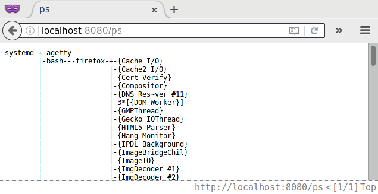
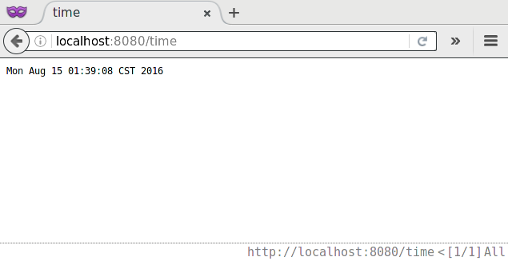
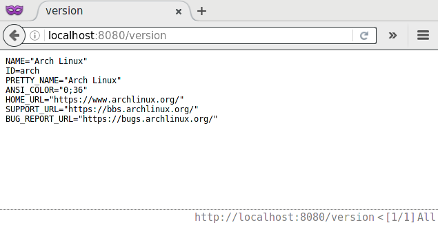
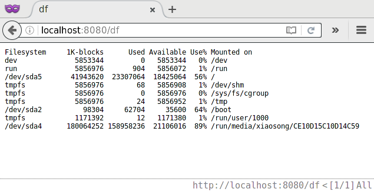
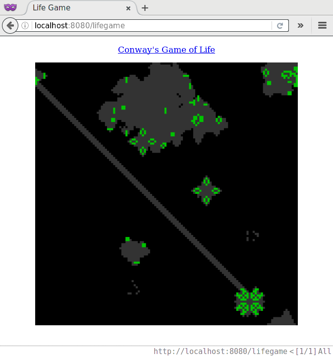

Course Requirements
===
- HTTP Server offering system information including:
	- time
	- linux version
	- free disk space
	- processes running
- realtime webpage when requested
- modules compiled as dynamic shared library, and allows load/unload at runtime
- process/thread pool to handle http request
- run under non-root
- OOP

Main Feature
===
1. an console to control

2. load/unload module at runtime

3. detect files under modules directory

4. multithread responsing
See source file `taskqueue.h` and `server.cc` for detail.

Usage
===
`$ make` under main directory to build main program.

Enter `modules` directory and run `./getMod.sh` to get modules build.

After build, run `bin/server` to start program.

To see command list.

	>>> help

To detect files under `./modules` directory relative to `server` executable

	>>> cand

To see working dynamic modules:

	>>> status

To load module in file `demo`:

	>>> load demo

To unload module named `demo`:

	>>> unload demo

ScreenShot
===

Required dynamic modules
---

Easter Egg
---

Modules
===
- Main Program
	- HTTP Receiver/Sender
	- Module
	- Console
	- Thread Pool
- Information Gathering Modules

Workflow
===
- [X] HTTP Receiver/Sender
- [X] load Module
- [X] Manipulate Program
- [X] Modules info
- [X] Thread Pool and Arranger
- [X] More Modules
	- [X] time
	- [X] version
	- [X] df
	- [X] ps
- [ ] Testing
